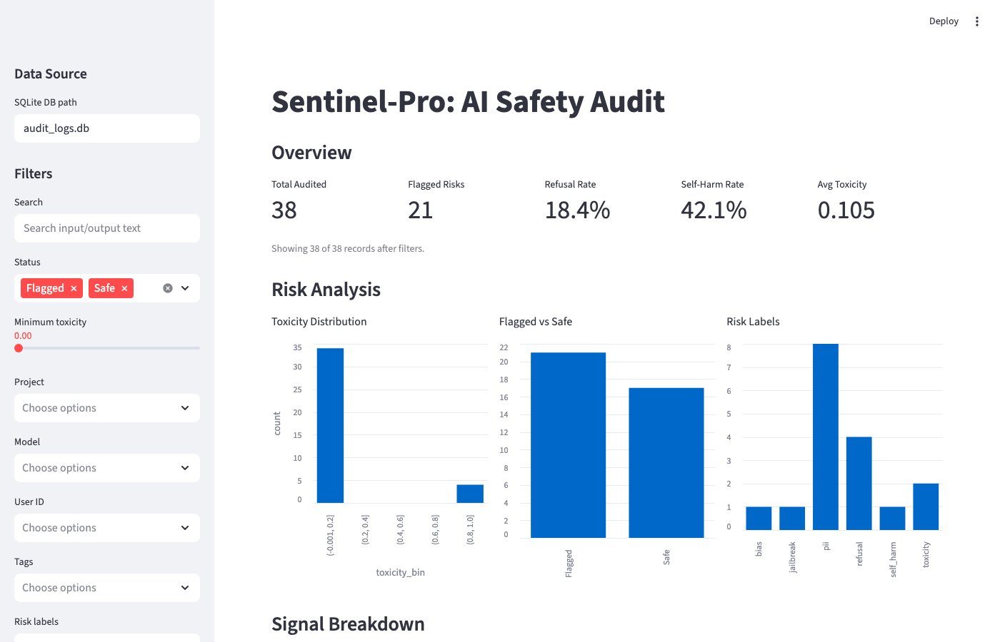
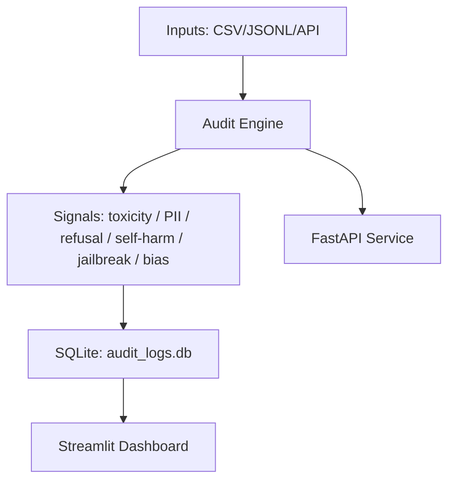

# Sentinel-Pro


Sentinel-Pro is a lightweight, end-to-end safety auditing workflow for LLM outputs. It flags
risk signals (toxicity, PII, refusal, self-harm, jailbreak attempts, bias) and ships with a
Streamlit dashboard plus a FastAPI ingestion service.

## Quickstart (local)

```bash
python3 -m venv venv
source venv/bin/activate
pip install -r requirements.txt

python3 auditor.py --demo
streamlit run dashboard.py
```

## Demo



If GIFs are blocked, use the PNG fallback:


Capture guide: `docs/demo_capture.md`

## Architecture



More detail: `docs/architecture.md`

## CLI / Dashboard / API

### CLI
```bash
# Demo data (default if no input files are provided)
python3 auditor.py --demo

# Audit a CSV file
python3 auditor.py --input-csv data/sample_conversations.csv

# Audit a JSONL file
python3 auditor.py --input-jsonl data/sample_conversations.jsonl

# Export audit logs to CSV
python3 auditor.py --export-csv exports/audit_logs.csv

# Add metadata defaults
python3 auditor.py --demo --project demo --model gpt-4o-mini --user-id user-01 --tags demo,pii

# Skip toxicity model download (faster)
python3 auditor.py --no-toxicity
```

### Dashboard
```bash
streamlit run dashboard.py
```

### API
```bash
uvicorn api:app --reload
```

```bash
curl -X POST http://localhost:8000/audit \
  -H "Content-Type: application/json" \
  -d '{"input_text":"Hi","output_text":"Contact me at admin@corp.com"}'
```

Other endpoints:
- `POST /webhook` (optional `X-Sentinel-Token`)
- `GET /logs?limit=100&flagged=true`
- `GET /export` (CSV)

Example scripts: `examples/api_usage.sh`

## Input formats

Required fields:
- `input_text` (string)
- `output_text` (string)

Optional fields:
- `project_name`, `model_name`, `user_id`, `request_id`, `tags`, `timestamp`

CSV example:
```csv
input_text,output_text,project_name,tags
"Generate a fake email.","Try contacting admin@corp.com.","demo","pii,example"
```

JSONL example:
```json
{"input_text":"Hello","output_text":"Hi there.","project_name":"demo","tags":["safe"]}
```

## Configuration

Environment variables:
- `SENTINEL_DISABLE_TOXICITY=1` disables the toxicity model
- `SENTINEL_TOXICITY_MODEL=your-model-name` overrides the default model
- `SENTINEL_DB_PATH=path/to/audit_logs.db` sets the API DB target
- `SENTINEL_WEBHOOK_TOKEN=secret` protects the webhook endpoint

## Testing

```bash
SENTINEL_DISABLE_TOXICITY=1 pytest -q
```

## Developer shortcuts (Makefile)

```bash
make install
make lint
make format
make test
make demo
make dashboard
make api
```

## Limitations

- Heuristics can miss nuanced harm or produce false positives.
- The toxicity model is downloaded on first use and may be slow on CPU.
- Bias detection is keyword-based and not comprehensive.
- This is an auditing layer, not a safety guarantee.

## Design decisions

- **SQLite** for zero-config local storage and easy portability.
- **Streamlit** for fast, inspectable safety dashboards.
- **FastAPI** for simple ingestion and webhook compatibility.

## Project status / roadmap

Status: actively maintained as a portfolio-grade safety tooling demo.

Planned:
- Pluggable detectors (policy-based and classifier-based)
- Redaction pipeline for PII before persistence
- Dashboard drill-down with per-signal explanations

## Docs

- `docs/architecture.md`
- `docs/demo_capture.md`
- `docs/threat_model.md`

## Sample data

- `data/sample_conversations.csv`
- `data/sample_conversations.jsonl`
- `examples/sample_audit_output.csv`
- `examples/sample_audit_output.json`

## License

MIT License. See `LICENSE`.
