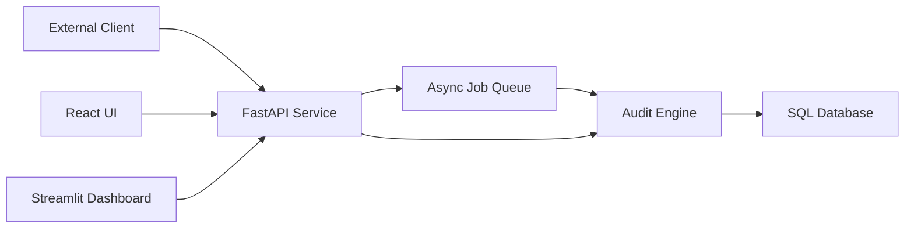

## Executive summary
Sentinel-Pro’s highest-risk themes are unauthorized data access, ingestion abuse (rate/queue exhaustion), and sensitive data exposure through misconfiguration. The most security-critical areas are authentication/role enforcement in `/Users/brady/Downloads/Sentinel-Pro/auth.py`, API ingestion and export endpoints in `/Users/brady/Downloads/Sentinel-Pro/api.py`, and persistence/redaction behavior in `/Users/brady/Downloads/Sentinel-Pro/auditor.py` and `/Users/brady/Downloads/Sentinel-Pro/db.py`.

## Scope and assumptions
In scope:
- `/Users/brady/Downloads/Sentinel-Pro/api.py`
- `/Users/brady/Downloads/Sentinel-Pro/auth.py`
- `/Users/brady/Downloads/Sentinel-Pro/auditor.py`
- `/Users/brady/Downloads/Sentinel-Pro/db.py`
- `/Users/brady/Downloads/Sentinel-Pro/migrations/`
- `/Users/brady/Downloads/Sentinel-Pro/web/`
- `/Users/brady/Downloads/Sentinel-Pro/docker-compose.yml`

Out of scope:
- Cloud perimeter controls (WAF/CDN/VPC ACLs)
- Secret manager implementations outside this repo
- Third-party service hardening details (Postgres hosting provider, Sentry account controls)

Assumptions:
- Deployment is internet reachable when not behind internal-only compose config.
- API keys are distributed out of band and not embedded in frontend bundles.
- `SENTINEL_REDACT_PII=1` remains enabled in production.
- TLS termination is provided via reverse proxy/ingress in production.

Open questions that materially affect risk ranking:
- Is Sentinel-Pro multi-tenant with strict tenant data isolation requirements?
- Are audit exports intended for external recipients or internal analysts only?
- What retention SLA is required for audit rows containing redacted but sensitive context?

## System model
### Primary components
- FastAPI ingestion/control plane (`/Users/brady/Downloads/Sentinel-Pro/api.py`)
- Auth and role enforcement (`/Users/brady/Downloads/Sentinel-Pro/auth.py`)
- Signal processing/redaction + DB writes (`/Users/brady/Downloads/Sentinel-Pro/auditor.py`)
- SQLAlchemy data model (`/Users/brady/Downloads/Sentinel-Pro/db.py`)
- Async worker queue in API process (`/Users/brady/Downloads/Sentinel-Pro/api.py`)
- React operator UI (`/Users/brady/Downloads/Sentinel-Pro/web/src/App.tsx`)
- Streamlit dashboard (`/Users/brady/Downloads/Sentinel-Pro/dashboard.py`)
- Postgres/SQLite persistence (`/Users/brady/Downloads/Sentinel-Pro/docker-compose.yml`, `/Users/brady/Downloads/Sentinel-Pro/db.py`)

### Data flows and trust boundaries
- Internet client -> FastAPI (`HTTP`)  
  Data: prompts, model outputs, metadata, API keys.  
  Guarantees: API key auth + RBAC, fixed-window rate limiting, optional webhook token, CORS policy.  
  Validation: Pydantic request models, query param constraints.
- FastAPI -> Audit engine (`in-process call`)  
  Data: output text and metadata.  
  Guarantees: internal function boundaries only.  
  Validation: detector heuristics and normalization.
- FastAPI -> DB (`SQLAlchemy / psycopg or sqlite`)  
  Data: redacted output, risk labels, metadata.  
  Guarantees: DB auth via URL, migration schema controls.  
  Validation: typed columns and code-level serialization.
- FastAPI -> Async worker queue (`in-memory queue`)  
  Data: serialized audit payloads + flags.  
  Guarantees: bounded queue size + worker readiness checks.  
  Validation: payload re-validated via Pydantic in worker.
- Operator browser -> React app -> FastAPI (`HTTP`)  
  Data: filters, incident report export, API key bearer token.  
  Guarantees: API auth + endpoint role checks.  
  Validation: backend filter parsing/parameterized SQL.

#### Diagram

## Assets and security objectives
| Asset | Why it matters | Security objective (C/I/A) |
| --- | --- | --- |
| API keys and role mapping | Control access to write/read/admin actions | C, I |
| Audit logs table (`audit_logs`) | Contains potentially sensitive prompt/output context | C, I |
| Redaction settings and behavior | Prevent raw PII persistence | C, I |
| Exported incident reports/CSV | Can be redistributed outside the system | C |
| Availability of ingest endpoints | Supports continuous monitoring workflows | A |
| Migration schema/history | Integrity of stored safety evidence and analytics | I, A |

## Attacker model
### Capabilities
- Remote unauthenticated attacker can send repeated requests to public endpoints.
- Attacker with leaked low-privilege key can enumerate accessible read/write routes.
- Authenticated user can submit crafted payloads (oversized/high-cardinality text, log pollution, export abuse).

### Non-capabilities
- No assumption of attacker shell access to host/container.
- No assumption attacker controls DB server credentials unless those secrets leak externally.
- No assumption attacker can bypass TLS if properly terminated by infrastructure.

## Entry points and attack surfaces
| Surface | How reached | Trust boundary | Notes | Evidence (repo path / symbol) |
| --- | --- | --- | --- | --- |
| `POST /api/audits` | API client/browser | Internet -> API | Primary ingestion path | `/Users/brady/Downloads/Sentinel-Pro/api.py` (`create_audit`) |
| `POST /api/audits/async` | API client/browser | Internet -> API -> queue | Async job amplification risk | `/Users/brady/Downloads/Sentinel-Pro/api.py` (`enqueue_job`) |
| `GET /api/reports/incidents` | Analyst/admin | Internet -> API | Sensitive report export path | `/Users/brady/Downloads/Sentinel-Pro/api.py` (`export_incident_report`) |
| `POST /webhook` | External integration | Internet -> API | Dual-auth surface (API key + optional token) | `/Users/brady/Downloads/Sentinel-Pro/api.py` (`verify_webhook_token`) |
| `GET /logs` and `GET /export` | Admin | Internet -> API | Bulk data exposure endpoint | `/Users/brady/Downloads/Sentinel-Pro/api.py` (`get_logs`, `export_logs`) |
| Frontend key storage | Browser localStorage | Browser trust boundary | Key theft if XSS is introduced | `/Users/brady/Downloads/Sentinel-Pro/web/src/App.tsx` |

## Top abuse paths
1. Obtain an analyst/admin API key -> call `/api/reports/incidents` or `/export` repeatedly -> exfiltrate sensitive audit history.
2. Flood `/api/audits/async` with valid but expensive payloads -> saturate queue/worker throughput -> degrade ingestion SLAs.
3. Submit crafted payloads containing deceptive content -> poison downstream analyst workflows and exported reports.
4. Misconfigure auth (`SENTINEL_AUTH_DISABLED=1`) in exposed environment -> unauthenticated writes/reads on audit data.
5. Disable PII redaction (`SENTINEL_REDACT_PII=0`) during debugging and forget to restore -> persist raw identifiers at scale.
6. Abuse high-privilege endpoint `/logs` with broad filters -> extract complete audit corpus.
7. Abuse webhook endpoint with leaked token and ingest key -> hidden ingestion of malicious noise data.

## Threat model table
| Threat ID | Threat source | Prerequisites | Threat action | Impact | Impacted assets | Existing controls (evidence) | Gaps | Recommended mitigations | Detection ideas | Likelihood | Impact severity | Priority |
| --- | --- | --- | --- | --- | --- | --- | --- | --- | --- | --- | --- | --- |
| TM-001 | External attacker with leaked key | Valid API key for analyst/admin role | Export report/CSV data via read endpoints | Confidentiality loss of safety logs | API keys, audit logs, exports | Role checks in `/Users/brady/Downloads/Sentinel-Pro/auth.py`; route role policies in `/Users/brady/Downloads/Sentinel-Pro/api.py` | No per-key scoping by project/tenant | Add per-project/tenant authorization claims and scope checks; short-lived keys | Alert on unusual export volume per key | medium | high | high |
| TM-002 | Unauthenticated remote actor | Internet exposure to API | Send high-volume ingest to exhaust CPU/queue | Availability degradation | Ingest availability, queue workers | Rate limiting middleware and bounded queue in `/Users/brady/Downloads/Sentinel-Pro/api.py` | Fixed-window limit may be too coarse for bursty abuse | Add IP reputation/WAF, adaptive rate limits, request body size caps | Monitor 429 spikes and queue depth growth | high | medium | high |
| TM-003 | Authenticated ingest actor | Valid ingest/analyst key | Queue flooding using `/api/audits/async` | Delayed processing, stale incident visibility | Queue, API latency SLO | Queue max size + worker count + `/readyz` checks | No per-role queue quota isolation | Add per-key queue quotas and dead-letter policy | Alert on queue depth and failed job count | medium | medium | medium |
| TM-004 | Misconfigured operator | Deployment config control | Set `SENTINEL_AUTH_DISABLED=1` in prod | Full unauthorized data access/write | All protected API surfaces | Auth defaults in `/Users/brady/Downloads/Sentinel-Pro/auth.py` | Config risk remains operational | Add startup hard-fail for unsafe env in non-dev; policy-as-code checks in CI | Startup config audit logs + deployment policy check | medium | high | high |
| TM-005 | Insider/debug workflow | Ability to modify runtime config | Disable redaction and ingest PII payloads | Raw PII retention in DB/exports | Redaction guarantees, compliance posture | Default redaction in `/Users/brady/Downloads/Sentinel-Pro/auditor.py` | No immutable guardrails around redaction flag | Enforce redaction in production profile; gate disable behind explicit break-glass | Alert when redaction_applied drops unexpectedly | medium | high | high |
| TM-006 | External attacker | Public endpoint reachability | Probe readiness and health endpoints for service intel | Recon for targeted attacks | Availability posture metadata | Separate `/healthz` and `/readyz` endpoints in `/Users/brady/Downloads/Sentinel-Pro/api.py` | Readiness currently returns detailed check info | Return minimal readiness detail publicly, detailed checks behind admin auth | Log unusual probe patterns | medium | low | low |
| TM-007 | Browser-side compromise (XSS supply chain) | Inject script into web origin | Steal API key from localStorage | Privilege theft for API access | API keys, audit data | Key required for API calls; backend RBAC | Key stored in localStorage is extractable under XSS | Move to short-lived tokens/session storage + CSP hardening | Detect anomalous key usage from new IP/UA | low | high | medium |

## Criticality calibration
Critical:
- Unauthorized full dataset exfiltration across all projects.
- Unauthenticated write/read access in internet-exposed mode.
- Persistent storage of raw PII due disabled redaction in production.

High:
- Compromised privileged key enabling broad exports.
- Queue/ingest abuse that materially degrades analyst response windows.
- Authorization bypass for admin-only endpoints.

Medium:
- Single-tenant scoped data leakage.
- Sustained nuisance DoS with straightforward mitigation.
- Weak operational controls that need additional policy hardening.

Low:
- Health endpoint reconnaissance without exploit chain.
- Minor metadata leakage not containing user-sensitive content.
- Noisy abuse attempts blocked by current controls.

## Focus paths for security review
| Path | Why it matters | Related Threat IDs |
| --- | --- | --- |
| `/Users/brady/Downloads/Sentinel-Pro/api.py` | Main trust boundary enforcement, queueing, exports, rate limits | TM-001, TM-002, TM-003, TM-006 |
| `/Users/brady/Downloads/Sentinel-Pro/auth.py` | API key parsing and role authorization logic | TM-001, TM-004 |
| `/Users/brady/Downloads/Sentinel-Pro/auditor.py` | Redaction policy and persistence behavior | TM-005 |
| `/Users/brady/Downloads/Sentinel-Pro/db.py` | Canonical schema and DB URL resolution behavior | TM-001, TM-005 |
| `/Users/brady/Downloads/Sentinel-Pro/migrations/` | Schema integrity and migration correctness | TM-001 |
| `/Users/brady/Downloads/Sentinel-Pro/web/src/App.tsx` | Browser key handling and export UX | TM-007 |
| `/Users/brady/Downloads/Sentinel-Pro/docker-compose.yml` | Production deployment defaults and env safety | TM-004 |

## Quality check
- All discovered externally reachable entry points are covered.
- Each trust boundary is represented in abuse paths and threat rows.
- Runtime surfaces are separated from CI/dev assumptions.
- Assumptions and open questions are explicit.
- Recommendations are tied to concrete files and controls in this repo.
