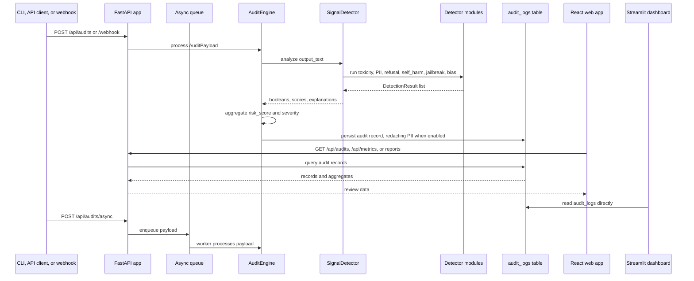

# Architecture

Sentinel-Pro is a local-first AI safety observability stack. It can run as a single
machine demo with SQLite, or as a small fullstack deployment with Postgres, FastAPI,
React, nginx, and Streamlit through Docker Compose.

The repository keeps the core auditing logic in a package and leaves top-level files such
as `api.py`, `auditor.py`, `signals.py`, and `db.py` as compatibility entrypoints.

## Current package structure

```text
sentinel_pro/
  api/
    app.py                 FastAPI app, route handlers, queue workers, reports
    middleware/            reserved package for future middleware split
    routes/                reserved package for future route split
  auth/
    dependencies.py        OAuth2 JWT validation and role requirements
  core/
    auditor.py             AuditEngine, record model, risk aggregation, CLI helpers
    signals.py             SignalDetector facade
      detectors/
      base.py              DetectionResult, severity helpers, Detector base class
      classifier.py        local model and judge helper for classifier-backed signals
      toxicity.py          optional transformers-based toxicity score
      pii.py               Presidio-backed PII detection and redaction
      refusal.py           refusal/compliance signal
      self_harm.py         self-harm keyword signal
      jailbreak.py         prompt-injection/jailbreak classifier and policy signal
      bias.py              protected-class bias classifier and policy signal
  jobs/
    __init__.py            reserved package for future job modules
  storage/
    db.py                  SQLAlchemy table definition, engine, schema sync
```

Supporting application surfaces:

- `dashboard.py`: Streamlit review dashboard.
- `web/`: React control panel for filters, metrics, audit review, and incident exports.
- `scripts/evaluate.py`: small regression evaluation harness.
- `scripts/check_eval_regression.py`: baseline-vs-current precision/recall gate.
- `migrations/`: Alembic migrations for SQLite/Postgres schema changes.
- `deploy/`: nginx configs for default, TLS, and internal-only Compose deployments.

## Runtime data flow



The CLI uses the same `AuditEngine` and `SignalDetector` path as the API, so CSV/JSONL
audits and HTTP ingestion produce the same persisted record shape.

## Storage model

Audit records are stored in the `audit_logs` table. SQLite is the default for local
development; Postgres is used by the Docker Compose stack.

Important columns:

- `timestamp`, `input_text`, `output_text`
- signal fields: `toxicity_score`, `has_pii`, `is_refusal`, `self_harm`, `jailbreak`,
  `bias`, `sentiment_score`
- risk fields: `risk_labels`, `risk_explanations`, `risk_score`, `severity`,
  `detector_results`, `flagged`
- redaction fields: `pii_types`, `redaction_applied`, `redaction_count`
- metadata fields: `project_name`, `model_name`, `user_id`, `request_id`, `tags`

`sentinel_pro/storage/db.py` can create missing tables and columns for local development
when `SENTINEL_AUTO_MIGRATE=1`. Production-style runs should use Alembic migrations and
set `SENTINEL_AUTO_MIGRATE=0`.

## API and auth boundary

The FastAPI app in `sentinel_pro/api/app.py` owns:

- liveness and readiness checks
- OAuth2 JWT authentication and role-scoped authorization
- request rate limiting
- synchronous audit ingestion
- batch and async audit ingestion
- audit listing/detail filters
- aggregate metrics and runtime queue metrics
- Markdown/JSON incident report export
- legacy `/audit`, `/logs`, and `/export` compatibility routes

Auth is configured with `SENTINEL_OAUTH_CLIENTS` and `SENTINEL_JWT_SECRET`. Clients
exchange credentials at `/oauth/token`, then call APIs with `Authorization: Bearer <jwt>`.
Current roles:

- `admin`: read, write, incident reports, legacy logs, CSV export
- `analyst`: read and write audit records
- `ingest`: write audit records only

Health endpoints do not require auth. `/webhook` uses normal write-role auth and can also
require `X-Sentinel-Token` when `SENTINEL_WEBHOOK_TOKEN` is set.

## Detector model

Each detector returns a `DetectionResult`:

```text
label, detected, risk_score, severity, explanation, metadata, is_risk_signal
```

`SignalDetector` runs all detectors and preserves their individual outputs in
`detector_results`. `AuditEngine` then builds the top-level record fields:

- `risk_labels`: labels detected for the record
- `risk_explanations`: human-readable reasons such as matched phrases or thresholds
- `flagged`: true when at least one risk-triggering label is present
- `risk_score`: max normalized score across risk-triggering labels
- `severity`: max severity across risk-triggering labels

`refusal` is intentionally marked as `is_risk_signal=False`. It is useful for behavior and
compliance review, but it does not make a record `flagged` on its own.

PII detection is Presidio-backed. The default configuration focuses on direct identifiers
such as email addresses, phone numbers, payment numbers, network identifiers, and
country-specific government or health IDs. Contextual entities such as dates, URLs,
people, organizations, and locations can be enabled with `SENTINEL_PII_INCLUDE_CONTEXTUAL=1`
and `SENTINEL_PII_NLP_MODEL` when an NLP model is installed.

Jailbreak and bias detectors first try local Hugging Face classifiers when available,
then an optional HTTP judge endpoint, and finally deterministic policy rules. The fallback
rules preserve explainability and keep the eval harness deterministic when model weights
are not present in the local cache.

## Evaluation harness

`scripts/evaluate.py` reads `eval/labeled.jsonl`, runs the signal detectors, and reports
per-signal precision, recall, F1, and confusion counts. `scripts/check_eval_regression.py`
compares a current metrics JSON file with `eval/baseline_metrics.json`.

`eval/labeled.jsonl` is a regression dataset, not a production benchmark. It is small,
hand-labeled, and intentionally simple so behavior changes are easy to notice during
development.

## Deployment shape

Default Docker Compose services:

- `db`: Postgres 16
- `api`: gunicorn + Uvicorn worker serving `api:app`
- `dashboard`: Streamlit process connected to the same database
- `web`: Vite-built React app served by nginx

Only the web service exposes a host port by default. TLS and internal-only variants are
provided by `docker-compose.tls.yml`, `docker-compose.internal.yml`, and nginx configs in
`deploy/`.

## Design intent

- Keep the core detector and audit path easy to inspect.
- Make every stored finding explainable enough for a human reviewer.
- Support SQLite for low-friction demos and Postgres for realistic service deployment.
- Separate ingest, review, export, and health surfaces through API roles and endpoints.
- Treat evaluation as regression protection, not as benchmark marketing.
